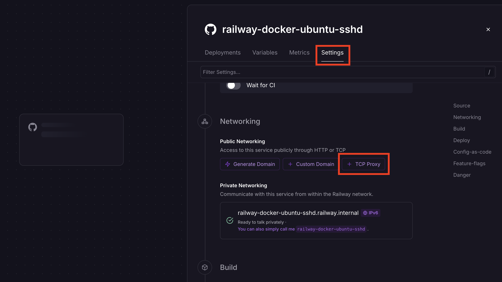

<p align="center">
  
</p>

<h1 align="center">ARA TM — سرور SSH اوبونتو روی Railway 🚂</h1>

<p align="center">
  <b>ایستگاه کاری ابری مخصوص خودت روی Railway</b> — با دسترسی root از طریق SSH و Claude Code از پیش نصب‌شده و آماده به کار.
  <br/>
  <b>Your own cloud workstation on Railway</b> — SSH in as <b>root</b>, with <b>Claude Code</b> pre-installed.
</p>

<p align="center">
  🇮🇷 فارسی &nbsp;·&nbsp; 🇬🇧 <a href="README.md">English</a>
</p>

<p align="center">
  
  
  
  
  
  
</p>

---

ایمیج داکری ساخته‌شده برای **Railway** که بر پایه **Ubuntu 24.04** با سرور **SSH (SSHD)** فعال، **رمز عبور اجباری root**، یک جعبه‌ابزار کامل توسعه و **Claude Code** از پیش نصب‌شده است. از طریق SSH به کانتینر خود متصل شوید و از آن به عنوان ایستگاه کاری ابری قابل‌حمل استفاده کنید — یا با Claude Code ترمینالی هوشمند داشته باشید.

A Docker image built for **Railway** that provides an **Ubuntu 24.04** base with an **SSH server (SSHD)** enabled, a **mandatory root password**, a full developer toolkit, and **Claude Code** pre-installed.

## ✨ ویژگی‌ها / Features

- 🐧 **اوبونتو ۲۴.۰۴** / Ubuntu 24.04 base image
- 🔑 **ورود root فعال** — مستقیماً با `root` وصل شوید / connect directly as `root`
- 🛡️ **رمز عبور root اجباری** — اگر `ROOT_PASSWORD` ست نشده باشد، دیپلوی ایمن متوقف می‌شود / mandatory root password
- 👤 کاربر sudo ثانویه اختیاری (`SSH_USERNAME` / `SSH_PASSWORD`) / optional secondary sudo user
- 🌐 ابزارهای شبکه و توسعه: `curl`, `wget`, `git`, `vim`, `nano`, `micro`, `htop`, `btop`, `ncdu`, `tmux`, `zsh`, Python 3, Node.js + npm
- 🧠 **Claude Code** (رابط خط فرمان رسمی Anthropic) از پیش نصب‌شده، با دستور `cl` / `زم`
- 🌍 لوکِیل انگلیسی و فارسی (`en_US.UTF-8`, `fa_IR.UTF-8`)
- 🎨 بنر خوش‌آمد ARA TM هنگام ورود / ARA TM welcome banner on login
- 🗣️ پیام‌های دوزبانه هنگام اجرا (`APP_LANG=fa` برای فارسی) / bilingual runtime messages

## ⚠️ هشدار مهم / Important Notice

**Railway کانتینرهای داکر اجرا می‌کند، نه VPS!** هر داده‌ای در کانتینر هنگام هر بار redeploy **از دست می‌رود** — فایل‌ها، بسته‌ها، تغییرات پیکربندی و داده‌های کاربر. برای ذخیره‌سازی ماندگار از Volumeهای Railway استفاده کنید.

**Railway runs Docker containers, not a VPS!** Any data stored in the container is **lost on every redeploy**.

## 🚀 دیپلوی روی Railway / Deploy to Railway

1. مخزن را Fork یا Clone کنید و به یک پروژه جدید **Railway** متصل کنید.
2. به **Settings → Variables** بروید و حداقل `ROOT_PASSWORD` (الزامی) را ست کنید.
3. به **Settings → Networking → Public Networking** بروید و یک **TCP Proxy** روی پورت `22` اضافه کنید.
4. **Redeploy** کنید. Railway دامنه و پورتی برای دسترسی SSH در اختیار شما می‌گذارد.

## 🌱 متغیرهای محیطی / Environment Variables

| متغیر | الزامی | پیش‌فرض | توضیح |
|-------|:------:|---------|-------|
| `ROOT_PASSWORD` | ✅ بله | — | رمز کاربر **root**. **الزامی** — بدون آن کانتینر اجرا نمی‌شود. |
| `SSH_USERNAME` | ⬜ خیر | — | کاربر sudo ثانویه اختیاری. باید با `SSH_PASSWORD` ست شود. |
| `SSH_PASSWORD` | ⬜ خیر | — | رمز کاربر اختیاری. |
| `AUTHORIZED_KEYS` | ⬜ خیر | — | کلید(های) عمومی SSH برای root (ورود با رمز همچنان روشن می‌ماند). |
| `ANTHROPIC_AUTH_TOKEN` | ⬜ خیر | — | توکن Claude Code (OpenRouter / Anthropic). روی هر دیپلوی اعمال می‌شود. |
| `APP_LANG` | ⬜ خیر | `en` | زبان پیام‌ها: `en` یا `fa`. |

> اتصال Claude Code (آدرس پایه، نام مدل‌ها، تم) از پیش در `claude-settings.json` تنظیم شده و پیش‌فرض روی **OpenRouter** است.
> The Claude Code connection is pre-configured in `claude-settings.json` and points to **OpenRouter** by default.

## 🔌 اتصال از طریق SSH / Connect via SSH

پس از دیپلوی، مستقیماً با کاربر root وصل شوید:

```bash
ssh root@<domain-railway> -p <port>
```

هنگام درخواست `yes` بزنید تا کلید میزبان پذیرفته شود، سپس رمز `ROOT_PASSWORD` را وارد کنید.

## 🧠 استفاده از Claude Code / Using Claude Code

[Claude Code](https://github.com/anthropics/claude-code) از پیش نصب شده است. پس از اتصال:

```bash
claude --version      # بررسی نصب بودن
cl                    # یا / or:  زم   → باز کردن نشست tmux با Claude Code
```

دستور `cl` (و `زم`) یک نشست **tmux** به نام `claude` باز کرده و Claude Code را در آن اجرا می‌کند. برای جدا شدن `Ctrl+B` و سپس `D` را بزنید.

### توکن احراز هویت / Auth token

توکن **هرگز داخل ایمیج بیک نمی‌شود** و از طریق یکی از روش‌ها وارد می‌شود:

- **آرگومان ساخت:** `docker build --build-arg ANTHROPIC_AUTH_TOKEN="sk-or-..." -t ara-ssh .`
- **متغیر محیطی Railway:** `ANTHROPIC_AUTH_TOKEN` را ست کنید — روی هر اجرا در تنظیمات بازنویسی می‌شود، پس ویرایش آن روی دیپلوی بعدی اثر می‌گذارد.

## 📦 بسته‌های موجود / Included Packages

**شبکه:** `curl`, `wget`, `iproute2`, `iputils-ping`, `net-tools`, `dnsutils`, `traceroute`, `whois`, `telnet`, `nmap`
**ویرایشگر:** `vim`, `nano`, `micro`
**مانیتورینگ:** `htop`, `btop`, `ncdu`, `neofetch`
**ترمینال:** `tmux`, `screen`, `less`, `tree`, `bat`, `ripgrep`, `fd-find`, `jq`, `zsh`
**آرشیو:** `unzip`, `zip`, `tar`, `gzip`, `bzip2`, `xz-utils`, `p7zip-full`
**توسعه:** `git`, `build-essential`, `cmake`, `pkg-config`, `autoconf`, `automake`, `libtool`, `gcc`, `g++`, `python3`, `python3-pip`, `python3-venv`, `nodejs`, `npm`
**لوکِیل:** `locales`, `language-pack-en`, `language-pack-fa`

## 🔒 امنیت / Security

- **رمز root الزامی است** — هرگز بدون `ROOT_PASSWORD` دیپلوی نکنید.
- پس از اولین ورود رمز را تغییر دهید.
- توکن Claude Code **هرگز** در ایمیج ذخیره نمی‌شود؛ آن را محرمانه نگه دارید.
- برای دسترسی مبتنی بر کلید، `AUTHORIZED_KEYS` را در نظر بگیرید.

## 📦 محدودیت‌های کانتینر / Container Limitations

- **بدون ذخیره‌سازی ماندگار** — داده‌ها روی هر دیپلوی پاک می‌شوند.
- **VPS نیست** — محیط کانتینری است.
- برای داده ماندگار از **Railway Volume Mount** استفاده کنید.

## 🩺 عیب‌یابی / Troubleshooting

- مطمئن شوید TCP proxy روی پورت `22` ست است.
- دامنه و پورت صحیح را از داشبورد Railway چک کنید.
- اگر کانتینر هنگام اجرا crash می‌کند، بررسی کنید `ROOT_PASSWORD` ست شده باشد.
- فراموش نکنید داده‌ها روی هر دیپلوی پاک می‌شوند.

## 📄 مجوز / License

تحت مجوز MIT منتشر شده — نگاه کنید به [LICENSE](LICENSE).

---

<p align="center">
  © ARA TM · نگهداری‌کننده <b>Parham_7991</b> · ساخته‌شده برای Railway 🚂
</p>
