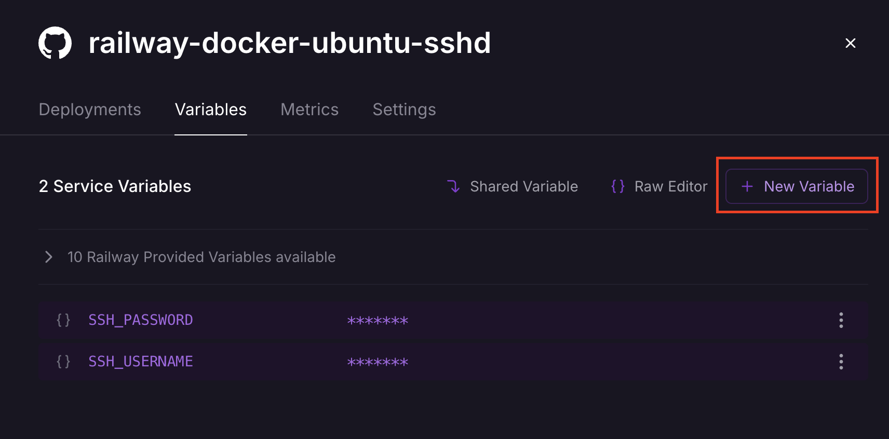
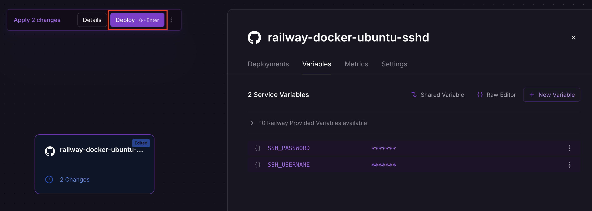
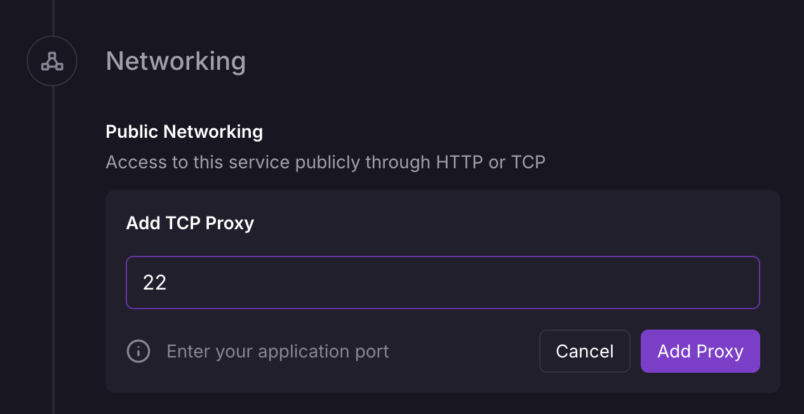
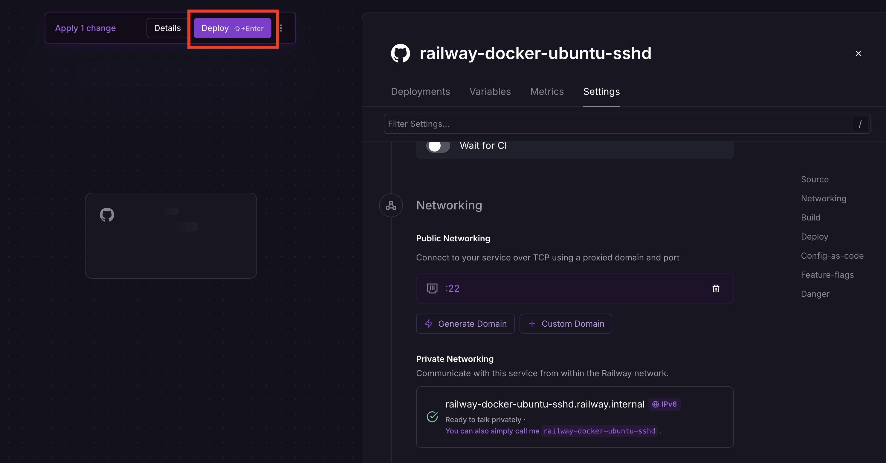
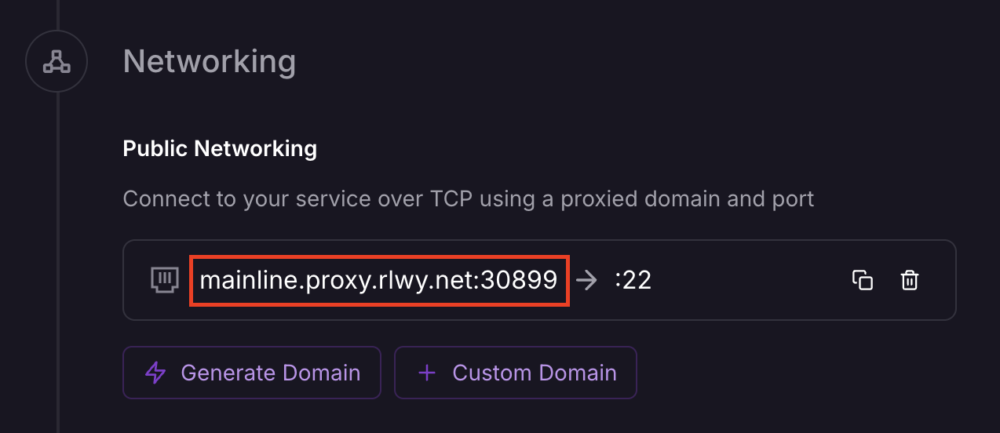

# ARA TM — Railway Docker Ubuntu SSH Server

> Developer / توسعه‌دهنده: **Parham_7991**


**Your own cloud workstation on Railway — SSH in as root, with Claude Code pre-installed and ready to go.**

**ایستگاه کاری ابری مخصوص خودت روی Railway — با دسترسی root از طریق SSH و Claude Code از پیش نصب‌شده و آماده به کار.**

A Docker image designed for Railway deployment that provides an Ubuntu 24.04 base with SSH server enabled (SSHD). This allows you to connect to your Railway container via SSH for remote access and management.

ایمیج داکری طراحی‌شده برای دیپلوی روی Railway که بر پایه Ubuntu 24.04 با سرور SSH فعال (SSHD) است. این امکان را فراهم می‌کند که از طریق SSH به کانتینر Railway خود متصل شوید تا به صورت از راه دور به آن دسترسی داشته و آن را مدیریت کنید.

## Features / ویژگی‌ها

- Ubuntu 24.04 base image / ایمیج پایه Ubuntu 24.04
- SSH server (OpenSSH) pre-configured / سرور SSH (OpenSSH) از پیش پیکربندی‌شده
- Password authentication enabled / احراز هویت با رمز عبور فعال
- Root login enabled by default (connect directly as root) / ورود root به صورت پیش‌فرض فعال (اتصال مستقیم با کاربر root)
- Created user has sudo permissions / کاربر ایجادشده دسترسی sudo دارد
- Network utilities included (ping, telnet, iproute2, curl, wget) / ابزارهای شبکه موجود (ping, telnet, iproute2, curl, wget)
- Essential developer tools (git, vim, nano, htop, tmux, unzip, zip, build-essential) / ابزارهای اصلی توسعه (git, vim, nano, htop, tmux, unzip, zip, build-essential)
- Node.js and npm pre-installed (required for Claude Code) / Node.js و npm از پیش نصب‌شده (لازم برای Claude Code)
- **Claude Code** (Anthropic official CLI) pre-installed / **Claude Code** (رابط خط فرمان رسمی Anthropic) از پیش نصب‌شده
- Bilingual runtime messages (English / Persian) / پیام‌های دوزبانه هنگام اجرا (انگلیسی / فارسی)

## ⚠️ Important Notice / هشدار مهم

**Railway runs Docker containers, not VPS!** Any data stored in the container will be **lost when redeploying**. This includes files created after deployment, installed packages, configuration changes and user data. If you need persistent storage, consider using Railway's volume mounts or external storage solutions.

**Railway کانتینرهای داکر اجرا می‌کند، نه VPS!** هر داده‌ای که در کانتینر ذخیره شود هنگام redeploy **از دست می‌رود**. این شامل فایل‌های ایجادشده بعد از دیپلوی، بسته‌های نصب‌شده، تغییرات پیکربندی و داده‌های کاربر است. اگر به ذخیره‌سازی ماندگار نیاز دارید، از Volumeهای Railway یا راهکارهای ذخیره‌سازی خارجی استفاده کنید.

## Setup Instructions / دستورالعمل راه‌اندازی

### STEP 1: Configure SSH Credentials / تنظیم اعتبارنامه SSH

#### Option 1: Modify ssh-user-config.sh / گزینه ۱: ویرایش فایل ssh-user-config.sh

1. **Before deploying**, edit the `ssh-user-config.sh` file and change the default values:

   ۱. **پیش از دیپلوی**، فایل `ssh-user-config.sh` را ویرایش کرده و مقادیر پیش‌فرض را تغییر دهید:

   ```bash
   # Change these default values to your desired credentials
   # این مقادیر پیش‌فرض را به اعتبارنامه دلخواه خود تغییر دهید
   : ${SSH_USERNAME:="myuser"}
   : ${SSH_PASSWORD:="mypassword"}
   ```

2. Commit and push your changes to your repository / کامیت و پوش کردن تغییرات به مخزن خود
3. **Then** deploy to Railway / **سپس** روی Railway دیپلوی کنید

#### Option 2: Use Railway Environment Variables / گزینه ۲: استفاده از متغیرهای محیطی Railway

1. **Deploy** to Railway / **دیپلوی** روی Railway
2. Go to your project dashboard / به داشبورد پروژه خود بروید
3. Navigate to **Settings** → **Variables**: / به مسیر **Settings** ← **Variables** بروید:

   

4. Add the following environment variables / متغیرهای محیطی زیر را اضافه کنید:
   - `SSH_USERNAME` - Your desired username / نام کاربری دلخواه
   - `SSH_PASSWORD` - Your desired password / رمز عبور دلخواه
   - `ROOT_PASSWORD` - Root password (default: `rootpassword`; set a strong one) / رمز root (پیش‌فرض: `rootpassword`؛ یک رمز قوی تنظیم کنید)
   - `AUTHORIZED_KEYS` - SSH public keys for key-based authentication (optional) / کلیدهای عمومی SSH برای احراز هویت مبتنی بر کلید (اختیاری)
   - `APP_LANG` - Display language: `en` (default) or `fa` for Persian / زبان نمایش: `en` (پیش‌فرض) یا `fa` برای فارسی

5. Redeploy your project to apply the new environment variables: / پروژه را برای اعمال متغیرهای جدید مجدداً دیپلوی کنید:

   

### STEP 2: Configure TCP Proxy / تنظیم TCP Proxy

1. Go to your Railway project dashboard / به داشبورد پروژه Railway خود بروید
2. Navigate to **Settings** → **Networking**: / به مسیر **Settings** ← **Networking** بروید:

   

3. Under **Public Networking**, click **TCP Proxy** / در بخش **Public Networking** روی **TCP Proxy** کلیک کنید
4. Enter the exposed port `22` (the default SSH port): / پورت `22` (پورت پیش‌فرض SSH) را وارد کنید:

   

5. Click **Add Proxy** / روی **Add Proxy** کلیک کنید

### STEP 3: Redeploy the Project / مرحله ۳: دیپلوی مجدد پروژه

After configuring the TCP proxy, redeploy your project to apply the networking changes:

بعد از تنظیم TCP Proxy، پروژه را برای اعمال تغییرات شبکه مجدداً دیپلوی کنید:



### STEP 4: Connect via SSH / مرحله ۴: اتصال از طریق SSH

1. Once deployed, Railway will provide you with a domain and port for TCP access: / پس از دیپلوی، Railway دامنه و پورتی برای دسترسی TCP در اختیار شما قرار می‌دهد:

   

2. Use the SSH command to connect: / برای اتصال از دستور SSH استفاده کنید:
   ```bash
   ssh {username}@{domain} -p {port}
   ```
   Example / مثال:
   ```bash
   ssh myuser@mainline.proxy.rlwy.net -p 30899
   ```

3. When prompted about the host authenticity, type `yes` to accept the new key pair / هنگامی که از اصالت میزبان سؤال شد، `yes` تایپ کنید تا جفت کلید جدید پذیرفته شود
4. Enter the user password when prompted / رمز عبور کاربر را وقتی درخواست شد وارد کنید
5. You're now connected to your Railway container via SSH! / اکنون از طریق SSH به کانتینر Railway خود متصل هستید!

## Using Claude Code / استفاده از Claude Code

[Claude Code](https://github.com/anthropics/claude-code) (the official Anthropic CLI) is pre-installed in this image, so you can run it directly inside your Railway container after connecting via SSH.

[Claude Code](https://github.com/anthropics/claude-code) (رابط خط فرمان رسمی Anthropic) از پیش روی این ایمیج نصب شده است، بنابراین پس از اتصال از طریق SSH می‌توانید آن را مستقیماً داخل کانتینر Railway اجرا کنید.

1. Connect via SSH as described in STEP 4. / طبق مرحله ۴ از طریق SSH متصل شوید.
2. Verify the installation: / نصب بودن را تأیید کنید:
   ```bash
   claude --version
   ```
3. Authenticate and start: / احراز هویت کرده و اجرا کنید:
   ```bash
   claude
   ```
   - Use `ANTHROPIC_API_KEY` for API-based access, or log in with your Anthropic account when prompted. / برای دسترسی از طریق API از `ANTHROPIC_API_KEY` استفاده کنید یا هنگام درخواست با حساب Anthropic خود وارد شوید.

**Note:** Claude Code requires a TTY and a valid Anthropic API key or account login. Set `ANTHROPIC_API_KEY` as a Railway environment variable if you want it available on startup.

**نکته:** Claude Code به یک TTY و کلید API معتبر Anthropic یا ورود به حساب نیاز دارد. اگر می‌خواهید هنگام راه‌اندازی در دسترس باشد، `ANTHROPIC_API_KEY` را به عنوان متغیر محیطی Railway تنظیم کنید.

### Claude Code Settings / تنظیمات Claude Code

The image ships a Claude Code settings file (`~/.claude/settings.json`) pre-configured with the ARA TM defaults:

ایمیج به همراه فایل تنظیمات Claude Code (`~/.claude/settings.json`) از پیش پیکربندی‌شده با پیش‌فرض‌های ARA TM عرضه می‌شود:

```json
{
  "env": {
    "ANTHROPIC_BASE_URL": "https://openrouter.ai/api",
    "ANTHROPIC_AUTH_TOKEN": "<your token>",
    "ANTHROPIC_API_KEY": "",
    "ANTHROPIC_DEFAULT_SONNET_MODEL": "tencent/hy3:free",
    "ANTHROPIC_DEFAULT_HAIKU_MODEL": "tencent/hy3:free",
    "ANTHROPIC_DEFAULT_OPUS_MODEL": "tencent/hy3:free"
  },
  "theme": "dark"
}
```

- **Auth token / توکن احراز هویت:** Everything else is a fixed default; only the token is dynamic and is **not** baked in. You must supply it yourself:
  - **At build time** with a build arg: / همه چیز پیش‌فرض ثابت است و فقط توکن پویا است و بیک **نمی‌شود**. باید خودتان آن را تامین کنید:
    - **موقع ساخت (build)** با آرگومان ساخت:
      ```bash
      docker build --build-arg ANTHROPIC_AUTH_TOKEN="sk-or-v1-..." -t ara-tm-ssh .
      ```
  - **At runtime / on every deploy** by setting the `ANTHROPIC_AUTH_TOKEN` environment variable on Railway. The `ssh-user-config.sh` script rewrites the token in the settings file on each container start, so editing the token is applied automatically on the next deploy:
    - **در زمان اجرا / روی هر دیپلوی** با تنظیم متغیر محیطی `ANTHROPIC_AUTH_TOKEN` روی Railway. اسکریپت `ssh-user-config.sh` توکن را در هر بار اجرای کانتینر در فایل تنظیمات بازنویسی می‌کند، بنابراین ویرایش توکن روی دیپلوی بعدی به طور خودکار اعمال می‌شود:
      ```
      ANTHROPIC_AUTH_TOKEN=sk-or-v1-your-new-token
      ```
- **Models / مدل‌ها:** All three model tiers default to `tencent/hy3:free` via OpenRouter. Change them in `claude-settings.json` if needed. / هر سه سطح مدل پیش‌فرضاً روی `tencent/hy3:free` از طریق OpenRouter هستند. در صورت نیاز در `claude-settings.json` تغییر دهید.
- **Theme / تم:** `dark` by default. / پیش‌فرض `dark`.

**⚠️ Security:** The auth token is never baked into the image — it must be provided via the `ANTHROPIC_AUTH_TOKEN` build arg or Railway environment variable. Keep your token private and do not commit it to the repository.

**⚠️ امنیت:** توکن احراز هویت هرگز داخل ایمیج بیک نمی‌شود و باید از طریق آرگومان ساخت `ANTHROPIC_AUTH_TOKEN` یا متغیر محیطی Railway تامین شود. توکن خود را محرمانه نگه دارید و در مخزن کامیت نکنید.

### Quick command / دستور سریع

A helper command `cl` is available (also aliased as `زم`). It opens a tmux session named `claude` and runs Claude Code inside it. If the session already exists, it attaches to it.

یک دستور کمکی `cl` در دسترس است (با نام دوم `زم` نیز). این دستور یک نشست tmux به نام `claude` باز کرده و Claude Code را در آن اجرا می‌کند. اگر نشست از قبل وجود داشته باشد، به آن متصل می‌شود.

```bash
cl      # or / یا:  زم
```

To detach from the session without closing it, press `Ctrl+B` then `D`.

برای جدا شدن از نشست بدون بستن آن، کلیدهای `Ctrl+B` و سپس `D` را بزنید.

## Configuration Details / جزئیات پیکربندی

### Default Values / مقادیر پیش‌فرض

The current default values in `ssh-user-config.sh` are / مقادیر پیش‌فرض فعلی در `ssh-user-config.sh`:
- `SSH_USERNAME=myuser`
- `SSH_PASSWORD=mypassword`

**⚠️ Important:** Change default values before deploying to production.

**⚠️ مهم:** پیش از دیپلوی در محیط production، مقادیر پیش‌فرض را تغییر دهید.

### Environment Variable Priority / اولویت متغیرهای محیطی

The system checks for credentials in this order / سیستم اعتبارنامه‌ها را به این ترتیب بررسی می‌کند:
1. Railway environment variables (highest priority) / متغیرهای محیطی Railway (بالاترین اولویت)
2. Values set directly in `ssh-user-config.sh` (default if no environment variables) / مقادیر تنظیم‌شده در `ssh-user-config.sh` (پیش‌فرض در صورت نبود متغیر محیطی)

### Root Access / دسترسی root

Root login is **enabled by default** so you can connect directly as `root`. A root password is always created from the `ROOT_PASSWORD` environment variable (default: `rootpassword`).

ورود کاربر root به صورت پیش‌فرض **فعال** است تا بتوانید مستقیماً با کاربر `root` متصل شوید. رمز عبور root همیشه از متغیر محیطی `ROOT_PASSWORD` ساخته می‌شود (پیش‌فرض: `rootpassword`).

The Dockerfile enables root login with / Dockerfile ورود root را با این خط فعال می‌کند:

```dockerfile
&& echo "PermitRootLogin yes" >> /etc/ssh/sshd_config
```

**⚠️ Important:** Change the default root password before deploying to production. Set `ROOT_PASSWORD` via Railway environment variables or in `ssh-user-config.sh`.

**⚠️ مهم:** پیش از دیپلوی در محیط production، رمز پیش‌فرض root را تغییر دهید. مقدار `ROOT_PASSWORD` را از طریق متغیرهای محیطی Railway یا در `ssh-user-config.sh` تنظیم کنید.

**Note:** The created user (`SSH_USERNAME`) still has sudo permissions and is added to the sudo group.

**نکته:** کاربر ایجادشده (`SSH_USERNAME`) همچنان دسترسی sudo دارد و به گروه sudo اضافه شده است.

### Display Language / زبان نمایش

Runtime messages are shown in English by default. To switch the container's startup messages to Persian, set the `APP_LANG` environment variable to `fa`:

پیام‌های هنگام اجرا به صورت پیش‌فرض به انگلیسی نمایش داده می‌شوند. برای تغییر پیام‌های راه‌اندازی کانتینر به فارسی، متغیر محیطی `APP_LANG` را روی `fa` تنظیم کنید:

```bash
APP_LANG=fa
```

- `en` - English (default) / انگلیسی (پیش‌فرض)
- `fa` - Persian / فارسی

## Security Considerations / نکات امنیتی

- **CRITICAL:** Always change the default SSH credentials in `ssh-user-config.sh` before deploying to production / **بحرانی:** همیشه پیش از دیپلوی در محیط production، اعتبارنامه پیش‌فرض SSH را در `ssh-user-config.sh` تغییر دهید
- Root login is enabled by default — always set a strong `ROOT_PASSWORD` / ورود root به صورت پیش‌فرض فعال است — همیشه یک `ROOT_PASSWORD` قوی تنظیم کنید
- Only password authentication is enabled by default / به صورت پیش‌فرض فقط احراز هویت با رمز عبور فعال است
- The default user has sudo privileges for administrative tasks / کاربر پیش‌فرض برای کارهای مدیریتی دسترسی sudo دارد
- Consider using SSH keys (`AUTHORIZED_KEYS`) instead of passwords for better security / برای امنیت بیشتر از کلیدهای SSH (`AUTHORIZED_KEYS`) به جای رمز عبور استفاده کنید
- When using `AUTHORIZED_KEYS`, password authentication is automatically disabled / هنگام استفاده از `AUTHORIZED_KEYS`، احراز هویت با رمز عبور به طور خودکار غیرفعال می‌شود

## Container Limitations / محدودیت‌های کانتینر

- **No persistent storage:** All data is lost when redeploying. / **بدون ذخیره‌سازی ماندگار:** همه داده‌ها هنگام redeploy از دست می‌روند.
- **Not a VPS:** This is a containerized environment, not a virtual private server / **VPS نیست:** این یک محیط کانتینری است، نه سرور خصوصی مجازی
- **Temporary file system:** Any files created inside the image will be lost on restart/redeploy / **سیستم فایل موقت:** هر فایلی داخل ایمیج ایجاد شود روی restart/redeploy از دست می‌رود

**Important:** Consider using **Railway Volume Mount** for persistent storage.

**مهم:** برای ذخیره‌سازی ماندگار از **Railway Volume Mount** استفاده کنید.

## Troubleshooting / عیب‌یابی

- Ensure the TCP proxy is configured correctly on Railway / اطمینان حاصل کنید که TCP Proxy روی Railway به درستی پیکربندی شده است
- Verify the correct domain and port are being used / دامنه و پورت صحیح استفاده می‌شوند را بررسی کنید
- Check that the container is running and healthy / بررسی کنید که کانتینر در حال اجرا و سالم است
- Confirm firewall settings allow SSH connections / تنظیمات فایروال اجازه اتصال SSH را می‌دهد را تأیید کنید
- Verify credentials are set correctly in `ssh-user-config.sh` or Railway environment variables / اعتبارنامه‌ها به درستی در `ssh-user-config.sh` یا متغیرهای محیطی Railway تنظیم شده‌اند را بررسی کنید
- Remember that data loss occurs on every redeploy / به یاد داشته باشید که در هر بار redeploy داده‌ها از دست می‌روند

## License / مجوز

This project is licensed under the terms included in the LICENSE file.

این پروژه تحت شرایط مندرج در فایل LICENSE منتشر شده است.

---

© ARA TM — Maintained by / نگهداری شده توسط **Parham_7991**
